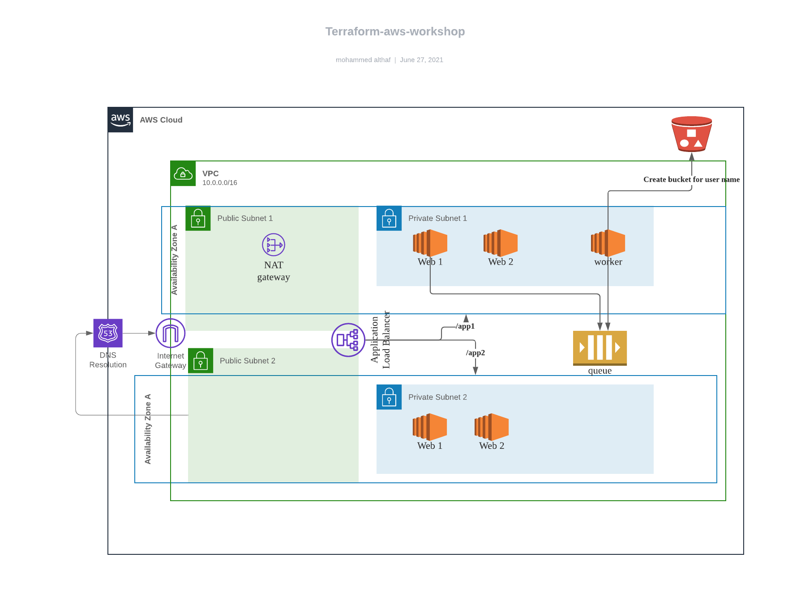

# Terraform AWS SQS 

This repository contains terraform scripts which will do the below

1. Create a two tier VPC with 2 public and private subnets.
2. Create and attach IGW , NAT.
3. Create ALB and configure listeners
4. Deploy 2 docker based web app(pushed to public repo) which are routed based on path.
5. ASG for 2 web app
6. Create SQS queue, create and IAM role which is attached two one of the instances.
7. Deploy a standalone worker ec2 which polls SQS for messages
7. Maintain state in s3

Architecture




To run:

1. Configure AWS cred
2. ```aws s3 mb s3://sgx-statefile``` (File to maintain state)
3. ```aws ec2 create-key-pair --key-name my_sgx```
4. ```terraform init```
5. ``terraform plan``
6. ```terraform apply``` 

Output:

```buildoutcfg
Apply complete! Resources: 34 added, 0 changed, 0 destroyed.

Outputs:

elb = web-lb-2070973971.us-east-1.elb.amazonaws.com

```


To Test:

```<elb>/app1``` redirects to app1

```<elb>/app2``` redirects to app2

```<elb>/app1/send_queue?user=name``` 

submits job to queue which is picked by worker and processed


_creates a bucket in S3(Todo)_